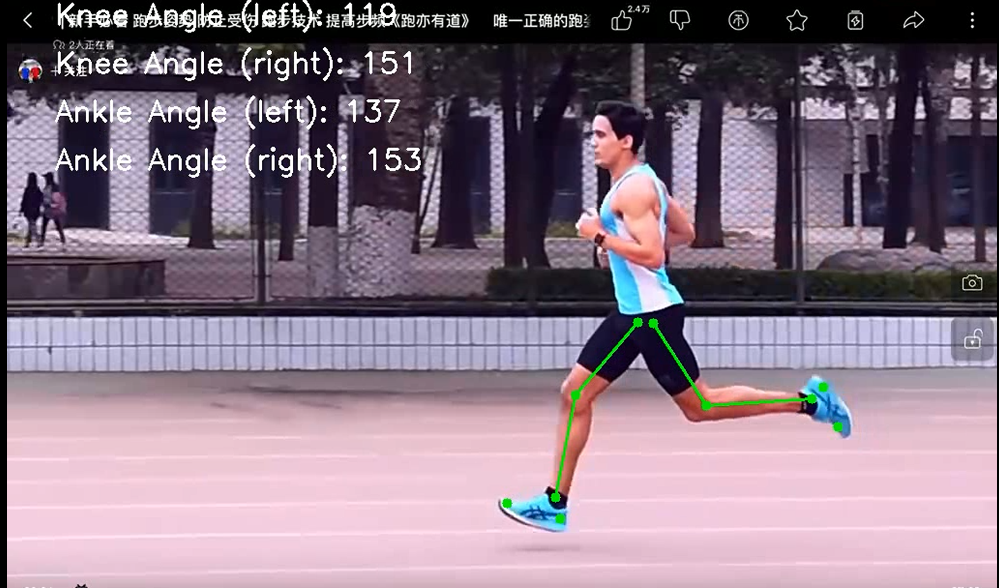

# Running_Pose_Visualization

**Running Pose Visualization** 是一个基于计算机视觉和姿态估计技术的视频分析工具，旨在通过标注下肢关键点，实时分析并展示跑步姿势。它能帮助用户分析膝关节和踝关节的角度，以评估跑步时的步态。

## 特性

- 使用 MediaPipe 提供的姿态估计模型标注视频中的下肢关键点
- 计算膝关节和踝关节的角度
- 动态显示分析结果，包括膝关节和踝关节角度
- 支持本地视频处理，输入视频并输出带有姿势分析的处理后视频

## 安装与依赖

### 环境要求

- Python 3.6 或更高版本
- 安装以下依赖库：

```
mediapipe
opencv-python
numpy
```

### 依赖项

- `mediapipe`：用于姿态估计的计算机视觉库
- `opencv-python`：用于处理视频文件的库
- `numpy`：用于数学运算

### 运行示例



